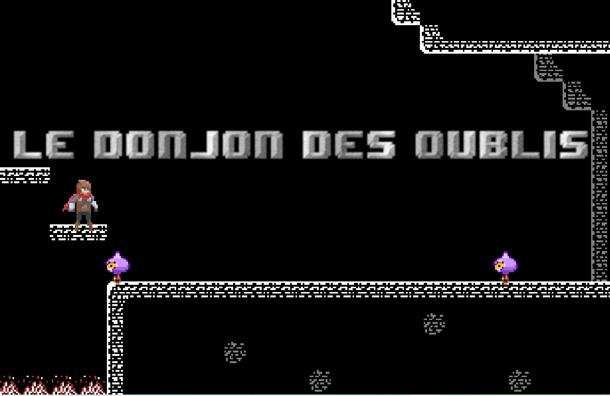

# Le donjon des oublis

Simple game in javascript, school project at Paris Ynov Campus

Created by [FeutreEnbois](https://github.com/FeutreEnBois), [ErikDRen](https://github.com/ErikDRen), [Silerion](https://github.com/Silerion) and Anthony GUERAND

Made with [Phaser](https://phaser.io), sprites by [0x72](https://0x72.itch.io/dungeontileset-ii)

Play it [here](https://sleepy-turing-a8f6ae.netlify.app/newone/)
